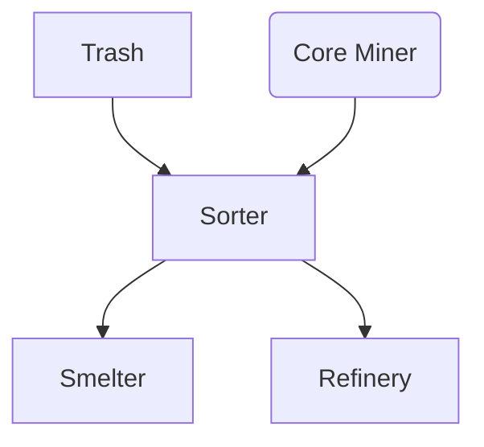
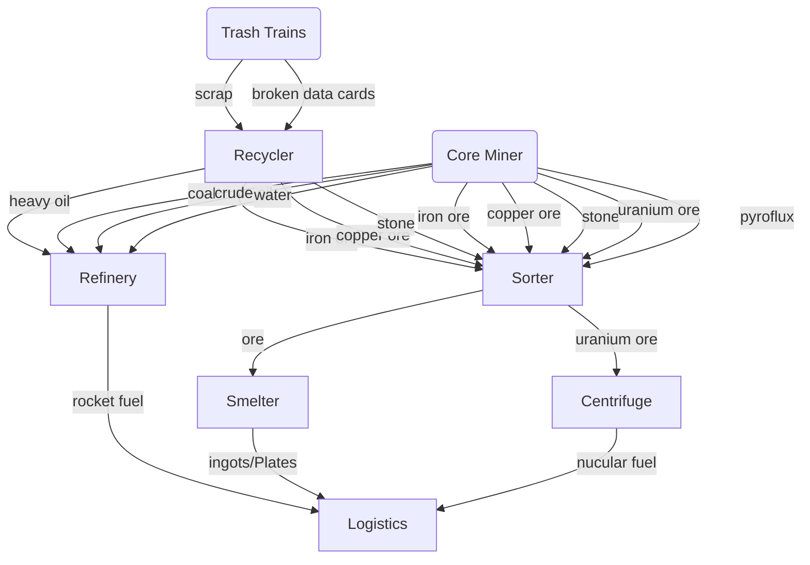

---
tags:
  - planet
---
![[planet.png]]

Zone type: Planet
Threat: 33%
Radius: 5692
deltaV: 100
Solar: 100%

The starting spawn planet in Space Exploration. This planet has balanced base resources. This is the central hub for manufacturing and launching rockets. It is also responsible for manufacturing base science. 

# Architecture
## Recycling & Core Mining
Nauvis is the recycling hub of the factory. Space science produces waste in the form of scrap and broken data cards. These waste components can be recycled into iron ore, copper ore, stone, and heavy oil. 

Core mines on Nauvis produce a slow but unlimited amounts of iron ore, copper ore, stone, uranium ore, crude oil, water, and pyroflux.

The ore from both of these operations flows into a sorting system which loads each time of ore onto its own train. These trains depart to smelting arrays when full. Note that core miners alone cannot supply the factory, rather it simply supplements it. 

Water and oil from this process are converted into rocket fuel

Small amounts of pyroflux are generated which is delivered to casting arrays. 
### High Level Diagram

### Low Level Diagram

## Main Bus
Commonly used materials are deposited onto a main bus. The bus flows left to right and elbows when needed (during stages of the game where landfill as not plentiful). At least 4 lanes should be dedicated to iron and copper plates. Splitters are used to branch materials off of the main bus. After these splitters additional splits should be used to re-balance the belts. 
## Rocket Hub
## TODO: Casting
## TODO: Rocket Resupply System 

# Supply Chain

# Tasks
- [ ] space elevator
- [ ] iron casting

